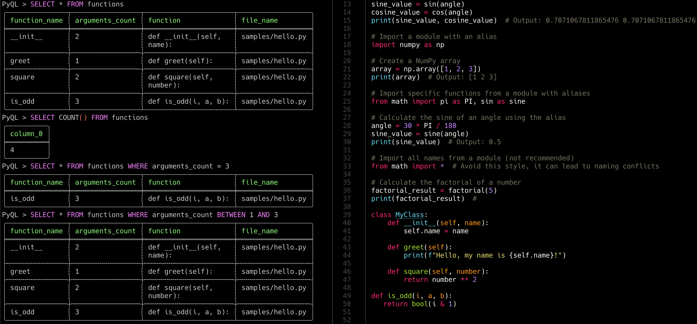

<h1 align="center">PyQL - A Python Query Language</h1></br>

<p align="center">

</p>

<p align="center">
  
  
  
  
</p>

<p align="center">
PyQL is a SQL like query language to run on Python source code files instead of database files using the GitQL SDK.
</p>

<p align="center">
  
</p>

---

### Tables structures

#### Functions table

| Name            | Type       | Description                              |
| --------------- | ---------- | ---------------------------------------- |
| function_name   | Text       | The name of Python function              |
| arguments_count | Integer    | The number of arguments in this function |
| functions       | PyFunction | A pointer to that Function Node in AST   |
| file_name       | Text       | File name that has this function         |


---

### Download or Install

- Install from Cargo.io

```
cargo install pyql
```

- Build from source code

```
git clone https://github.com/AmrDeveloper/PyQL.git
cd PyQL
cargo build
```

### Run PyQL

```
PyQL is a SQL like query language to run on Python source code files
Usage: PyQL [OPTIONS]

Options:
  -f,  --files <paths>        Path for local files to run query on
  -s,  --script <file>        Script file contains one or more query
  -q,  --query <GQL Query>    PyQL query to run on selected files
  -p,  --pagination           Enable print result with pagination
  -ps, --pagesize             Set pagination page size [default: 10]
  -o,  --output               Set output format [render, json, csv]
  -a,  --analysis             Print Query analysis
  -e,  --editor               Enable GitQL LineEditor
  -h,  --help                 Print PyQL help
  -v,  --version              Print PyQL Current Version
```

### License

```
MIT License

Copyright (c) 2024 Amr Hesham

Permission is hereby granted, free of charge, to any person obtaining a copy
of this software and associated documentation files (the "Software"), to deal
in the Software without restriction, including without limitation the rights
to use, copy, modify, merge, publish, distribute, sublicense, and/or sell
copies of the Software, and to permit persons to whom the Software is
furnished to do so, subject to the following conditions:

The above copyright notice and this permission notice shall be included in all
copies or substantial portions of the Software.

THE SOFTWARE IS PROVIDED "AS IS", WITHOUT WARRANTY OF ANY KIND, EXPRESS OR
IMPLIED, INCLUDING BUT NOT LIMITED TO THE WARRANTIES OF MERCHANTABILITY,
FITNESS FOR A PARTICULAR PURPOSE AND NONINFRINGEMENT. IN NO EVENT SHALL THE
AUTHORS OR COPYRIGHT HOLDERS BE LIABLE FOR ANY CLAIM, DAMAGES OR OTHER
LIABILITY, WHETHER IN AN ACTION OF CONTRACT, TORT OR OTHERWISE, ARISING FROM,
OUT OF OR IN CONNECTION WITH THE SOFTWARE OR THE USE OR OTHER DEALINGS IN THE
SOFTWARE.
```
